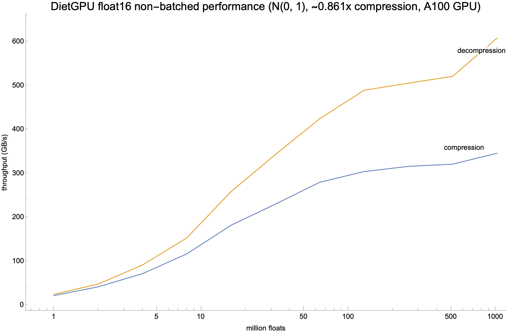

# DietGPU: a specialized lossless GPU compression library

Author: Jeff Johnson (@wickedfoo)

DietGPU is a library for very fast specialized lossless compression of data on Nvidia GPUs, meant for ML/HPC applications. This is an early alpha preview of the library; it is still under heavy development. The basics of the design should work on CC 3.5+ (Kepler class) GPUs or later, though it has been primarily developed for Ampere+ class GPUs and has only been tested on V100/A100 GPUs.

It currently consists of two parts:

- a generalized byte-oriented range-based [asymmetric numeral system (rANS)](https://en.wikipedia.org/wiki/Asymmetric_numeral_systems) entropy encoder and decoder, that operates at throughputs around 250-410 GB/s for sufficient data sizes on an A100 GPU.
- an extension to the above to handle fast lossless compression and decompression of unstructured floating point data, for use in ML and HPC applications, especially in communicating over local interconnects (PCIe / NVLink) and remote interconnects (Ethernet / InfiniBand). This operates at around 250-600 GB/s for sufficient data sizes on an A100 GPU.

Both APIs are available in both C++ (raw device pointers) and Python/PyTorch (PyTorch tensor) API forms.

## Library rationale

As on-device global memory / HBM bandwidth continues to improve at a faster rate than CPU/GPU interconnect or server-to-server networking bandwidth, spending GPU compute and gmem bandwidth to save on data sent over interconnects is becoming more advantageous. DietGPU aims to target this gap. Rather than supporting arbitrary structured data or dictionary/LZ type compression like [Nvidia's nvCOMP](https://github.com/NVIDIA/nvcomp), or even high compression rates, DietGPU biases towards the fastest, cheapest possible compression. It is meant for applications where speed rather than compression ratio is important; say in compressing data that is even sent between GPUs in a single server, or for use as a 1990s-style virtual RAM extender.

The initial focus and integrations of this library will be in HPC/ML distributed collective communications libraries, for primitives such as all-to-all, all-gather, reduce-scatter and all-reduce. Right now no off the shelf integration is provided, but the basics of the C++ API are available for use, as are Python-level PyTorch tensor-based APIs.

## ANS codec

The rANS codec operates on 8 bit bytes. It can compress arbitrary data, but using statistics gathered on a bytewise basis, so data highly structured or redundant at a level above byte level will typically not compress well. It is a GPU analogue to something like Yann Collet's [FSE (Finite State Entropy)](https://github.com/Cyan4973/FiniteStateEntropy) library. This codec is meant to be applicable for any number of lossless compression applications.

## Float codec

The floating point compressor at the moment uses the rANS codec to handle compression of floating point exponents, as typically in ML/HPC data a very limited exponent dynamic range is used and is highly compressible. Floating point sign and significand values tend to be less compressible / fairly high entropy in practice, though sparse data or presence of functions like ReLU in neural networks can result in a lot of outright zero values which are very compressible. A future extension to the library will allow for specialized compression of sparse or semi-sparse data, specializing compression of zeros. At the moment only bfloat16 and float16 are supported, with float32 support coming shortly.

## API design

Both APIs are available in both C++ (raw pointers) and Python/PyTorch (PyTorch tensor) API forms. It is a batch oriented API; both compression and decompression operate in batches of independent arrays of data which are independently compressed or decompressed, though with the floating point compressor, all arrays in the batch must be of the same data type. ANS compression symbol probabilities are calculated independently for each array in the batch, and each produced output compressed tensor in a batch is independently decompressible (and the ANS statistics are tailored to each individual array in the batch). See the wiki for details.

The APIs are oriented around batching, though providing a large batch size of 1 also results in good performance (in fact, bs > 1 has somewhat worse performance than bs = 1 for sufficiently large data sizes at the moment, due to work imbalance issues). Arrays in the batch can be of arbitrary, varying sizes. The library treats all data as unstructured 1 dimensional arrays, so the PyTorch API does not really care about dimensionality. The primitive unit of compression are 4 KiB segments of the input data, which are assigned to individual warps. Typically, it is not worth using DietGPU unless one has at least 512 KiB of data or so due to compression overheads, and poor performance will be seen unless the total data size (whether bs = 1 or a large batch) is enough such that (total size in bytes / 4 KiB) is on par with the number of concurrently running warps that will saturate a GPUs SMs.

All computation takes place completely on device. The design of the library pays special attention to avoiding memory allocations/deallocations and spurious device-to-host/host-to-device interactions and synchronizations where possible. Assuming inputs and outputs are properly sized and if enough temporary memory scratch space is provided up front, compression and decompression can run completely asynchronously on the GPU without CPU intervention. However, only the GPU during compression knows the actual final compressed size, and a typical application will need to copy the output buffer containing the final compressed sizes in bytes back to the host for use in relocating compressed data elsewhere (in local memory or over the network), so we know how much data to send or copy. As the final output size cannot be predicted in advance, a function is provided to bound the maximum possible compressed output size (which is in fact larger than the input data size) which can be used to allocate an appropriate region of memory for the output. Realizing actual compression savings for applications other than networking would involve an additional memory allocation and memcpy to a new exactly sized buffer.

## Performance

Performance depends upon many factors, including entropy of the input data (higher entropy = more ANS stack memory operations = lower performance), number of SMs on the device and batch/data sizes. Here are some sample runs using an A100 GPU and the advanced sync/alloc-free API on a batch size of 1 from the python PyTorch API, using `torch.normal(0, 1.0, [size], dtype=dt, ...)` to approximate a typical quasi-Gaussian data distribution as seen in real ML data.

## Planned extensions

- float32 support, possibly float64 support
- compression options to expect semi-sparse floating point data for higher compression (10-99% zero values)
- a fused kernel implementation (likely using CUDA cooperative groups) to support single-kernel compression and decompression minimizing temporary memory usage
- a fused kernel implementation using the above to support persistent NCCL-like all-reduce for collective communications libraries
- CUB-like APIs for fusing warp-oriented ANS compression and decompression into arbitrary user kernels
- int32/int64 compression using a fixed-word size LZ-type window history
- support for embedding table compression with sparse reads/row gathers

## License

DietGPU is licensed with the MIT license, available in the LICENSE file at the top level.
