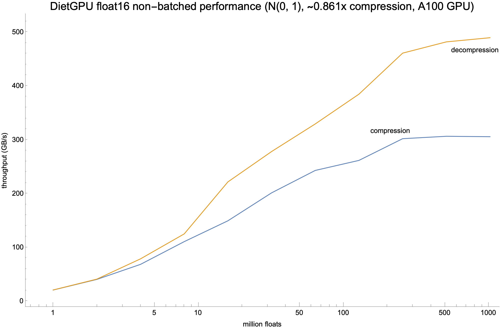

# DietGPU: specialized lossless compression at 250-600 GByte/s

Author: Jeff Johnson (@wickedfoo), `jhj _at_ fb.com`

*(NOTE: very early alpha preview of the library; it is still under rapid development)*

DietGPU is a library for fast specialized lossless compression of data on Nvidia GPUs, meant for ML/HPC applications. It also contains the first publicly available GPU-based generalized [asymmetric numeral system (ANS)](https://en.wikipedia.org/wiki/Asymmetric_numeral_systems) compressor and decompressor. It is a GPU analogue to Yann Collet's [FSE (Finite State Entropy)](https://github.com/Cyan4973/FiniteStateEntropy) ANS library.

It currently consists of two parts:

- **ANS entropy codec**: a generalized byte-oriented range-based ANS (rANS) entropy encoder and decoder, that operates at throughputs around 250-410 GB/s for reasonable data sizes on an A100 GPU.
- **Floating point codec**: an extension to the above to handle fast lossless compression and decompression of unstructured floating point data, for use in ML and HPC applications, especially in communicating over local interconnects (PCIe / NVLink) and remote interconnects (Ethernet / InfiniBand). This operates at around 250-600 GB/s for reasonable data sizes on an A100 GPU.

Both APIs are available in both C++ (raw device pointers) and Python/PyTorch (PyTorch tensor) API forms.

## Building

Clone this repo using

```shell
git clone --recursive https://github.com/facebookresearch/dietgpu
cd dietgpu
```

Then the simplest way is to use the included Dockerfile, which installs the PyTorch dependencies *and* uses NVIDIA's dev image as a base (for the CUDA dependencies):

```shell
docker build -t dietgpu .
docker run --privileged --runtime=nvidia --rm -v $(pwd):/dietgpu -it dietgpu:latest
```

Note you need NVIDIA's container runtime installed (if on Fedora consult this [Github issue](https://github.com/NVIDIA/nvidia-docker/issues/706#issuecomment-851816502)).

Then do the standard CMake thing:

```shell
cd dietgpu; mkdir build; cd build;
cmake .. -G Ninja
cmake --build . --target all
```

If you get complaints about `TorchConfig.cmake` then your `CMAKE_PREFIX_PATH` doesn't have the right paths; run

```shell
python -c 'import torch;print(torch.utils.cmake_prefix_path)'
```

to discover where `TorchConfig.cmake` lives (and add that path to your `CMAKE_PREFIX_PATH`).
In general, you can run
```shell
export CMAKE_PREFIX_PATH="$(dirname $(which conda))/../:$(python -c 'import torch;print(torch.utils.cmake_prefix_path)')"
```

If you get complaints about `/dietgpu/third_party/glog... does not contain a CMakeLists.txt file.` then you didn't pull the submodules; run

```shell
git submodule sync
git submodule update --init --recursive --jobs 0
```
and try again.

## Library rationale

As on-device global memory / HBM bandwidth continues to improve at a faster rate than CPU/GPU interconnect or server-to-server networking bandwidth, spending GPU compute and gmem bandwidth to save on data sent over interconnects is becoming more advantageous. DietGPU aims to target this gap.

One can imagine a Pareto-optimal tradeoff curve between realizable compression ratios versus speed. On one end of the curve exists algorithms for supporting arbitrary data using dictionary/LZ type compression like some of the techniques in [Nvidia's nvCOMP](https://github.com/NVIDIA/nvcomp) at potentially high compression rates. At another end of the curve, one can imagine use completely on-device as something like a 1990s-style virtual RAM extender, where achievable compression is only 0.6x-0.9x or so, but compression can operate at around 1/4x to 1/2x the peak global memory bandwidth of the GPU. We emphasize the latter, where speed rather than compression ratio is important, where we can compress data that is even sent between GPUs in a single server over NVLink or PCIe. The savings may be low, but the effective network speed can be increased by 10-30%. For large-scale neural network training on hundreds of GPUs, this could translate into an additional 5-10% end-to-end performance increase.

The initial focus of this library will be in HPC/ML distributed collective communications libraries, for primitives such as all-to-all, all-gather, reduce-scatter and all-reduce. Right now no off the shelf integration is provided (in progress), but the basics of the C++ API are available for use, as are Python-level PyTorch tensor-based APIs.

## ANS codec

The rANS codec operates on 8 bit bytes. It can compress arbitrary data, but using statistics gathered on a bytewise basis, so data highly structured or redundant at a level above byte level will typically not compress well. This codec however is meant to be applicable for any number of lossless compression applications, including usage as an entropy coder for LZ or RLE type matches for a fully-formed compression system. Symbol probability precisions supported are 9, 10 and 11 bits (i.e., symbol occurances are quantized to the nearest 1/512, 1/1024 or 1/2048).

## Float codec

The floating point compressor at the moment uses the rANS codec to handle compression of floating point exponents, as typically in ML/HPC data a very limited exponent dynamic range is used and is highly compressible. Floating point sign and significand values tend to be less compressible / fairly high entropy in practice, though sparse data or presence of functions like ReLU in neural networks can result in a lot of outright zero values which are very compressible. A future extension to the library will allow for specialized compression of sparse or semi-sparse data, specializing compression of zeros. At the moment only float16 (IEEE 754 binary16) and bfloat16 (fields of the most significant 16 bits of a IEEE 754 binary32 word) are supported, with float32 (IEEE 754 binary32) support coming shortly.

## API design

The basics of the design should work on CC 3.5+ (Kepler class) GPUs or later, though it has been primarily developed for and has only been tested on V100/A100 GPUs.

Both APIs are available in both C++ (raw pointers) and Python/PyTorch (PyTorch tensor) API forms. It is a batch oriented API; both compression and decompression operate in batches of independent arrays of data which are independently compressed or decompressed, though with the floating point compressor, all arrays in the batch must be of the same data type. ANS compression symbol probabilities are calculated independently for each array in the batch, and each produced output compressed tensor in a batch is independently decompressible (and the ANS statistics are tailored to each individual array in the batch). See the wiki for details.

The APIs are oriented around batching, though providing a large batch size of 1 also results in good performance (in fact, bs > 1 has somewhat worse performance than bs = 1 for sufficiently large data sizes at the moment, due to work imbalance issues). Arrays in the batch can be of arbitrary, varying sizes. The library treats all data as unstructured 1 dimensional arrays, so the PyTorch API does not really care about dimensionality. The primitive unit of compression are 4 KiB segments of the input data, which are assigned to individual warps. Typically, it is not worth using DietGPU unless one has at least 512 KiB of data or so due to compression overheads, and poor performance will be seen unless the total data size (whether bs = 1 or a large batch) is enough such that (total size in bytes / 4 KiB) is on par with the number of concurrently running warps that will saturate a GPUs SMs.

All computation takes place completely on device. The design of the library pays special attention to avoiding memory allocations/deallocations and spurious device-to-host/host-to-device interactions and synchronizations where possible. Assuming inputs and outputs are properly sized and if enough temporary memory scratch space is provided up front, compression and decompression can run completely asynchronously on the GPU without CPU intervention. However, only the GPU during compression knows the actual final compressed size, and a typical application will need to copy the output size buffer containing the final compressed sizes per compression job in the batch in bytes back to the host for use in relocating compressed data elsewhere (in local memory or over the network), so we know how much data to send or copy. As the final output size cannot be predicted in advance, a function is provided to bound the maximum possible compressed output size (which is in fact larger than the input data size) which can be used to allocate an appropriate region of memory for the output. Realizing actual compression savings for applications other than networking would involve an additional memory allocation and memcpy to a new exactly sized buffer.

## Performance

Performance depends upon many factors, including entropy of the input data (higher entropy = more ANS stack memory operations = lower performance), number of SMs on the device and batch/data sizes. Here are some sample runs using an A100 GPU and the sync/alloc-free API on a batch size of 1 from the python PyTorch API, using `torch.normal(0, 1.0, [size], dtype=dt, ...)` to approximate a typical quasi-Gaussian data distribution as seen in real ML data. The float codec for bfloat16 extracts and compresses just the 8 bit exponent, while for float16 it currently operates on the most significant byte of the float word (containing the sign bit, 5 bits of exponent and 2 bits of significand). Typical ML float data might only have 2.7 bits of entropy in the exponent, so the savings ((8 + 2.7) / 16 ~= 0.67x for bfloat16, (11 + 2.7) / 16 ~= 0.85x for float16) is what is seen in the exponent-only strategy.




## Planned extensions

- float32 support, possibly float64 support
- compression options to expect semi-sparse floating point data for higher compression (>10% zero values)
- a fused kernel implementation (likely using CUDA cooperative groups) to support single-kernel compression and decompression minimizing temporary memory usage
- a fused kernel implementation using the above to support persistent NCCL-like all-reduce for collective communications libraries
- CUB-like APIs for fusing warp-oriented ANS compression and decompression into arbitrary user kernels
- int32/int64 compression using a fixed-word size LZ-type window history
- support for embedding table compression with sparse reads/row gathers

## References

Prior GPU-based ANS implementations [to my knowledge](https://encode.su/threads/2078-List-of-Asymmetric-Numeral-Systems-implementations) include:

- [GST: GPU-decodable Supercompressed Textures](https://gamma.cs.unc.edu/GST/) (not a generalized ANS codec; meant as part of a texture compression scheme)
- Weissenberger and Schmidt, [Massively Parallel ANS Decoding on GPUs](https://dl.acm.org/doi/10.1145/3337821.3337888) (a decoder only)

Related GPU entropy coder works include:

- Yamamoto et al., [Huffman Coding with Gap Arrays for GPU Acceleration](https://dl.acm.org/doi/10.1145/3404397.3404429)

Related lossless floating point compression works include:

- Lindstrom and Isenburg, [Fast and Efficient Compression of Floating-Point Data](https://computing.llnl.gov/projects/fpzip) (CPU-based)
- Various GPU works from Martin Burtscher's group at Texas State such as Yang et al., [MPC: A Massively Parallel Compression Algorithm for Scientific Data](https://www.semanticscholar.org/paper/MPC%3A-A-Massively-Parallel-Compression-Algorithm-for-Yang-Mukka/1ab6910c90ad714e29954ccd69d569eb2003eb20)

These works are sometimes oriented at compressing HPC-type data (e.g., 2d/3d/Nd grid data) where there may be local/dimensional correlations that can be exploited.

[nvCOMP](https://github.com/NVIDIA/nvcomp), Nvidia's GPU lossless compression library.

## License

DietGPU is licensed with the MIT license, available in the LICENSE file at the top level.
